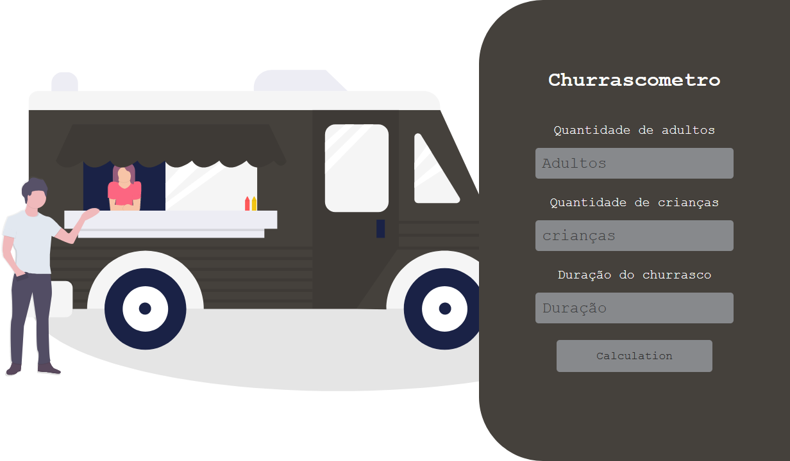

   Projeto desenvolvido no curso do programadorBR

 

  

  <a href="#sobre-o-projeto">Sobre o Projeto</a>&nbsp;&nbsp;&nbsp;|&nbsp;&nbsp;&nbsp;
  <a href="#tecnologias-utilizadas-no-curso">Tecnologias utilizadas no curso</a>&nbsp;&nbsp;&nbsp;|&nbsp;
  <a href="#tecnologias-que-eu-utilizei">Tecnologias que utilizei</a>

## Sobre o Projeto

Sistema para calcular a quantidade de comida e bebida necessária para um churrasco,
 
com base nas informações seguintes:
 
Carne - 400gr por pessoa + de 6horas - 650gr
 
Cerveja - 1200ml por Pessoa + 6 horas - 2000ml
 
Refrigerante/água - 1000ml por pessoa + 6 horas 1500ml
 
Crianças valem por 0,5.

## Tecnologias utilizadas no curso

No curso o projeto foi desenvolvido utilizando as seguintes tecnologias:

- HTML
- CSS
- JavaScript

## Tecnologias que eu utilizei 

O projeto foi desenvolvido utilizando as seguintes tecnologias:

- [Next.js](https://nextjs.org/)
- [Vercel](vercel.com/)